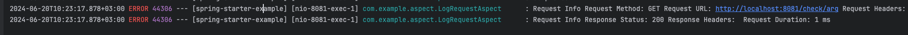
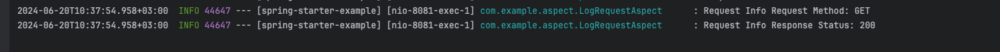

# Документация по Spring Boot Starter для логирования HTTP запросов

Для подключения `logger-spring-boot-starter` вам необходимо добавить зависимость:
```xml
<dependency>
<groupId>com.example</groupId>
<artifactId>logger-spring-boot-starter</artifactId>
<version>0.0.1-SNAPSHOT</version>
</dependency>
```

`Logger-spring-boot-starter` поддерживает 2 параметра, которые можно задать в файлах `application.properties` и `application.yml`:
`log.level` и `log.format`. 1-й параметр отвечает за уровень логирования, а 2-й за формат логов. 
По умолчанию `log.level=INFO`, a `log.format=Request Info: %s, %s, %s`.

Давайте рассмотрим какие значения вы можете указать самостоятельно. В качестве уровней логирования предлагается выбрать 1 из следующих 4-х:
`WARN`, `ERROR`, `INFO`. А в качестве формата логов можно указать любой префикс и выбрать количество параметров, которые хочется отслеживать, максимум можно указать 3 подстроки (%s).

Теперь можем рассмотреть примеры с различными настройками:
```properties
log.level=ERROR
log.format=Request Info %s %s %s
```


```properties
log.level=INFO
log.format=Request Info %s
```



